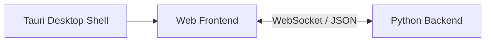
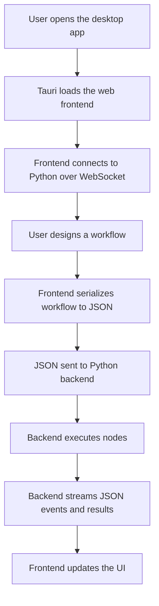

# PPNFlow

PPNFlow is a desktop visual workflow tool built around a simple architecture:

1. Tauri is only the desktop shell.
2. The web frontend handles workflow design and presentation.
3. The Python backend handles execution logic.
4. Frontend and backend communicate only through JSON over WebSocket.

## Architecture



### Tauri desktop shell

Tauri is the application container. It is responsible for:

- launching the desktop window
- packaging and distributing the app
- hosting the web frontend inside a desktop runtime

Tauri does not own workflow execution logic.

### Web frontend

The frontend is the user-facing workflow editor. It is responsible for:

- rendering the canvas and node graph
- handling node drag, connect, duplicate, delete, and configuration
- displaying execution status, outputs, and errors
- serializing the current workflow into JSON
- sending workflow requests to the Python backend over WebSocket

### Python backend

The backend is the execution engine. It is responsible for:

- accepting workflow JSON from the frontend
- parsing nodes, edges, and settings
- resolving execution order
- executing node logic
- streaming status, output, and error events back as JSON

## Runtime flow



## Request and event model

Frontend requests use JSON messages such as:

```json
{
  "id": "request-123",
  "method": "execute_graph",
  "params": {
    "graph": {
      "nodes": [],
      "edges": [],
      "settings": {}
    },
    "mode": "once"
  }
}
```

Backend responses and events also use JSON:

```json
{
  "event": "node_status",
  "data": {
    "id": "node_1",
    "status": "running"
  }
}
```

## Repository structure

```text
src/                Web frontend
src/components/     UI and editor components
src/hooks/          Frontend runtime hooks
src/lib/            Serialization, WebSocket client, utilities
src/stores/         Zustand stores

src-tauri/          Tauri desktop shell

engine/             Python backend
engine/nodes/       Backend node implementations
engine/providers/   AI and external provider adapters
engine/utils/       Backend helpers
```

## Main frontend responsibilities

- maintain the editable graph in local state
- serialize workflow data into backend-compatible JSON
- connect to the backend through WebSocket
- render backend execution events into node state, logs, and detail panels

## Main backend responsibilities

- load node definitions and schemas
- validate and parse workflow graphs
- execute workflows in topological order
- support loop execution and stop requests
- emit execution lifecycle events

## Development

### Desktop development

Use:

```bat
start-dev.bat
```

This starts:

- the Python WebSocket backend on `ws://localhost:9320`
- the Vite frontend for the Tauri window
- the Tauri desktop shell

### Web-only development

Use:

```bat
start-web.bat
```

This starts:

- the Python WebSocket backend on `ws://localhost:9320`
- the frontend on `http://localhost:1420`

## Tests

TypeScript static checks:

```bat
node_modules\.bin\tsc.cmd --noEmit
```

Python engine tests:

```bat
python engine\test_engine.py
```

## Design principles

- keep the desktop layer thin
- keep UI logic in the frontend
- keep execution logic in Python
- keep the protocol explicit and JSON-based
- keep frontend/backend coupling limited to the WebSocket contract

## Summary

PPNFlow is a Tauri-hosted desktop application whose web frontend designs workflows and whose Python backend executes them. The boundary between frontend and backend is intentionally simple: WebSocket plus JSON.
